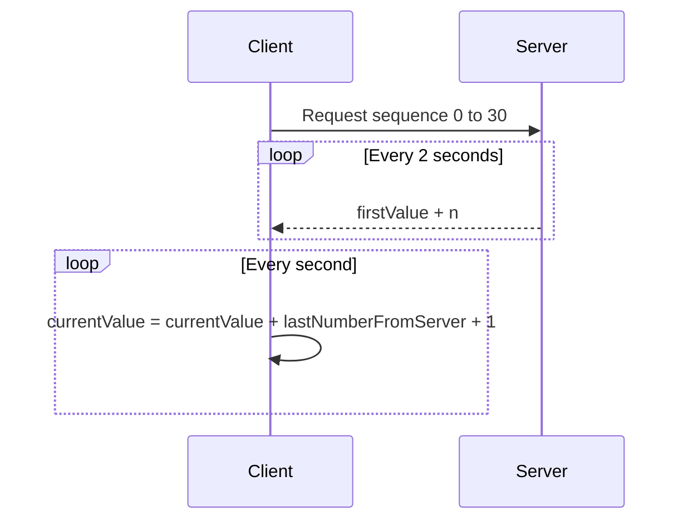

# gRPC Java Client-Server Application

## Description
This is a client-server application developed using gRPC technology, where the server generates a sequence of numbers and the client receives these numbers to perform calculations.

## Technologies
- Java
- gRPC

## Installation
To run this application, you will need JDK and Gradle installed.

1. Clone the repository:
```bash
git clone [your repository link]
```

2. Build the project:
```bash
gradle build
```

## Running the Server
To start the server, use the following command:
```bash
gradle runServer
```

## Running the Client
To start the client, use the following command:
```bash
gradle runClient
```

## Functionality

### Server Side
The server accepts requests from the client with a starting value (`firstValue`) and an ending value (`lastValue`). It then generates and sends a new value to the client every two seconds, starting from `firstValue + 1` to `lastValue`.

### Client Side
The client sends a request to the server to receive a sequence of numbers from 0 to 30. It then runs a loop from 0 to 50 and prints out a number (`currentValue`) to the console using the following formula:

$$ currentValue = \text{[currentValue]} + \text{[LAST number from server]} + 1 $$

The initial value of `currentValue` is 0. The number received from the server is only considered once.

## Communication Diagram

